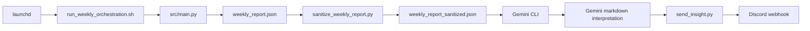

# Weekly Digest Orchestration Design

## Goal

Create a once-per-week local orchestration flow that runs on the macOS host after Friday U.S. market close, generates the weekly report, sanitizes it, sends the sanitized payload to the local Gemini CLI for interpretation, and posts the interpretation to a Discord channel configured in `.env`.

The design keeps Phase 14 and Phase 15 business semantics unchanged. It preserves the existing paper-only and `broker_submission_allowed=false` boundary.

## UX Principles

- Make the weekly result easy to scan in Discord.
- Keep the full audit trail on disk, not in chat.
- Fail closed on missing data, missing webhook, or sanitizer violations.
- Keep the operator flow deterministic. One run should produce one report, one interpretation, and at most one Discord post unless a resend is explicit.

## Architecture

### 1. Scheduler

Use `launchd` as the primary scheduler. It is the native macOS choice and avoids the portability and environment drift of `cron`.

The launchd job triggers a single shell orchestrator on Friday at the local equivalent of 16:15 ET. The plist stores no secrets and does not depend on `PATH`.

### 2. Orchestrator

The shell orchestrator coordinates the flow:

1. Resolve `week_end`.
2. Acquire a per-week lock with `mkdir`.
3. Generate the weekly report JSON.
4. Validate the JSON.
5. Sanitize the JSON with an allowlist policy.
6. Build a Gemini prompt from the sanitized JSON only.
7. Call local Gemini CLI.
8. Send either the Gemini insight or a deterministic fallback digest to Discord.
9. Write `run_status.json` atomically.

The orchestrator is a pure control layer. It does not compute signals, reinterpret the Phase 15 sandbox, or bypass the existing safety gate.

### 3. Report Generation

`src/main.py` becomes the machine-readable entrypoint for weekly report generation.

It reads the latest Phase 14 snapshot and Phase 15 sandbox summary from the local `outputs/` tree, then writes a deterministic JSON report to `--output`. Stdout stays minimal so the JSON body never gets mixed into logs or shell pipes.

### 4. Sanitization

`scripts/sanitize_weekly_report.py` is mandatory. It applies a strict allowlist, removes non-portable or sensitive fields, and rejects anything that still looks like a secret, webhook, token, password, email, account identifier, or absolute path.

The sanitized JSON is the only Gemini input.

### 5. Interpretation and Delivery

`src/output/send_insight.py` handles two modes:

- `insight`: send a Gemini-generated markdown interpretation.
- `fallback_error`: send a deterministic digest derived from sanitized JSON when Gemini fails.

The sender reads `DISCORD_WEBHOOK_URL` from the environment only. It never calls Gemini. It never reads raw unsanitized reports.

## Discord Message Design

Use one detailed, structured message. Keep it readable, not tabular.

Required sections:

- `Status Summary`
- `Key Metrics`
- `Risk / Exceptions`
- `Full Interpretation`
- `Action Note`

Do not include raw indicator tables. Do not include local artifact paths in the Discord body. Keep those on disk only.

This format balances readability with completeness. It lets the operator understand the week in one read while preserving the detailed interpretation requested.

## Data Flow

## Error Handling

### Missing Phase 15 Summary

Fail immediately with a clear instruction to run:

`python scripts/run_phase15_sandbox.py --week-end YYYY-MM-DD`

### Sanitizer Failure

Stop before Gemini. Do not send an unsanitized prompt.

### Gemini Failure

Send a deterministic fallback digest built from the sanitized JSON. Mark the error stage once with `notified_error_<stage>.ok`.

### Discord Failure

Return nonzero. Do not silently retry forever. Keep artifacts and logs on disk for inspection.

### Duplicate Runs

If `sent_discord.ok` exists, skip duplicate sends unless `--resend` is explicit. If `notified_error_<stage>.ok` exists, skip repeated error spam.

### Concurrency

Use `mkdir "$WEEK_DIR/.run_lock"` as the lock primitive. Treat stale lock recovery as explicit operator action.

## Testing Strategy

Add tests at four layers:

1. `src/main.py` generates valid JSON and keeps stdout clean.
2. Sanitizer removes secrets, absolute paths, and webhook material.
3. Discord sender supports dry-run, fallback, truncation, and retry behavior.
4. Orchestrator enforces locks, idempotency, atomic markers, and dry-run isolation.

Tests must use `tmp_path` and mocked subprocesses or local HTTP servers. They must not write to real production directories.

## Non-Goals

- No broker integration.
- No live order submission.
- No change to Phase 14 or Phase 15 business math.
- No general-purpose scheduling framework.
- No new UI beyond the Discord message structure and local artifacts.

## Implementation Order

1. Stabilize `src/main.py` as the report entrypoint.
2. Add allowlist sanitizer.
3. Add Discord sender with dry-run and fallback modes.
4. Add shell orchestrator and atomic marker handling.
5. Add launchd template.
6. Add tests for every branch above.

## Acceptance Criteria

- The weekly report JSON is deterministic and valid.
- Sanitized JSON is the only Gemini input.
- Dry-run does not call Gemini or Discord.
- Discord gets the detailed structured interpretation, not the raw report.
- Fallback digest is deterministic and compact.
- Successful sends are deduped by `sent_discord.ok`.
- Error notifications are deduped by stage.
- Launchd template contains no secrets and no `PATH` dependence.

